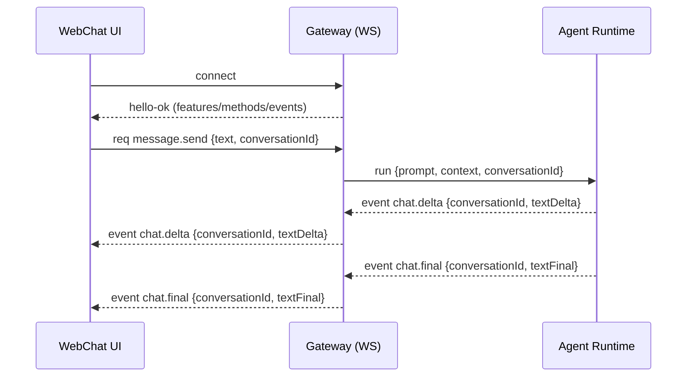

# Belldandy 实施计划

## 1. 范围与约束

- **开发目录**：`e:\project\Belldandy`
- **参考目录（只读）**：`E:\project\belldandy\openclaw`（不修改、不编码）
- **参考目录（只读）**：`E:\project\belldandy\UI-TARS-desktop-main`（不修改、不编码）


## 1.1 技术栈与工程形态（建议）

- Runtime：Node.js（对齐 moltbot 的思路，优先使用较新版本）
- 语言：TypeScript（ESM）
- 包管理：pnpm workspace（便于拆分 `core/agent/channels/skills/memory/ui`）
- 测试：vitest（单测 + 最小集成）
- 目录组织（规划）：
  - `packages/belldandy-core`
  - `packages/belldandy-agent`
  - `packages/belldandy-channels`
  - `packages/belldandy-skills`
  - `packages/belldandy-memory`
  - `apps/web`

## 2. 总体架构草图

```mermaid
flowchart TB
  subgraph Channels
    WebChat[WebChat UI]
    TG[Telegram Bot (phase 2)]
  end

  WebChat -->|WS| GW[Gateway]
  TG -->|inbound/outbound| GW

  GW -->|RPC/Invoke| AG[Agent Runtime]
  AG -->|tools| SK[Skills/Tools]
  AG -->|retrieve| MEM[Memory Index]

  GW -->|events chat/agent/presence| WebChat
```

## 3. 里程碑与阶段划分

### Phase 0：文档与边界（已完成）

- PRD、实施计划、README 在 `Belldandy/` 目录落盘
- 明确“moltbot 只读参考”的边界与模块对照表

### Phase 1：工程骨架（MVP 基础设施，已完成）

**目标**：能编译、能跑最小服务，具备基础配置与日志框架。

- 初始化工程结构（建议 monorepo 或单仓分包，取决于后续扩展）
- 约定模块边界：
  - `gateway`：WS/HTTP、鉴权、事件总线
  - `agent`：模型调用与流式输出、工具执行
  - `skills`：skills loader + 运行沙盒/白名单
  - `memory`：基础索引与检索接口（先 keyword）
  - `ui`：WebChat 最小界面
- 配置 schema：参考 moltbot 的 zod schema 设计出 Belldandy 最小 config（gateway/auth/logging/models/channels/skills）

**验收**：
- `gateway` 可以启动并输出启动信息
- 配置读取与校验可运行（错误提示可行动）

**已落地（当前仓库状态）**：
- 已建立 pnpm workspace + TypeScript project references 基础工程骨架
- 已实现 Gateway 可启动并服务静态 WebChat
- 已补齐最小 vitest 集成测试与 build 通过

### Phase 2：端到端最小闭环（WebChat，已完成：MockAgent）

**目标**：WebChat 输入一句话，看到流式回复；所有数据流走 Gateway。

- Gateway：实现 WS 握手/鉴权/req-res + 事件广播
- UI：实现最小 chat 页面：
  - 连接 WS
  - 发送 message
  - 订阅 chat delta/final 并渲染
- Agent：实现单 provider 的模型调用（先选一个），并把输出转成 Gateway 事件

**关键时序（建议）**：



**验收（E2E）**：
- WebChat → 发送消息 → 收到增量输出（delta）→ 收到 final
- 断线重连后能继续工作（可先简化为手动刷新）

**已落地（当前仓库状态）**：
- 已实现 `message.send` + `chat.delta/chat.final` 事件流
- Agent 默认使用 **MockAgent**（用于本地跑通协议与流式管道），并支持切换到 OpenAI 协议兼容 Provider
- WS 鉴权已支持 `none | token | password`（默认 none）

**Phase 2.1（真实模型 Provider，已落地：OpenAI 协议）**：
- 已支持 OpenAI 协议 `chat.completions`（可配置 base_url/api_key/model）
- 默认使用 SSE 流式返回并转发为 `chat.delta/chat.final`
- 通过环境变量启用（不在仓库保存 key）

### Phase 1.5: 极速启动 (One-Click Launchers) [已完成]

**核心目标**：让用户无需打开终端即可启动 Belldandy，并具备自动环境检查与依赖安装能力。

**已落地 (2026-02-04)**：
- **脚本实现**：
    - Windows (`start.bat`): 双击启动 -> 检查 node/pnpm -> `pnpm install` (如有必要) -> 启动 Gateway -> 自动打开浏览器。
    - macOS/Linux (`start.sh`): 同上。
- **运维能力**：
    - **自动重启环 (Restart Loop)**：脚本包含 `while` 循环，当 Gateway 进程以状态码 `100` 退出时，自动重新拉起进程。
    - **Magic Link**: 启动时生成一次性 Token 并自动打开浏览器，跳过 WebUI 的手动 Pairing 过程，直接进入。

### Phase 2.5: 可视化配置 & 医生 (Settings & Doctor) [已完成]

**核心目标**：提供一个简单的 Web 界面，让用户能直观地修改配置、诊断问题。

**已落地 (2026-02-04)**：
- **Prerequisite (Startup Optimization)**:
    - **宽容启动 (Lenient Mode)**：修改 `gateway.ts`，在缺少 Key 时不再 Crash，而是正常启动 Web 及 WS 服务。
    - **惰性检查 (Lazy Check)**：将 API Key 校验推迟到 `message.send` 请求时刻。若配置缺失，返回 `config_required` 错误码。
- **Feature: Doctor (贝贝医生)**:
    - **Backend**: 新增 `system.doctor` 接口，检查 Node 版本、网络连通性、向量库状态、Agent配置状态。
    - **Frontend**: 在 WebChat 设置页添加“体检”按钮，以可视化方式展示检查项。
- **Feature: Settings (配置)**:
    - 提供 API Key、Model、Heartbeat 等配置的可视化修改。
    - **重启按钮**: 界面点击“保存并重启” -> 后端 `process.exit(100)` -> 触发外部脚本的 Restart Loop。
- **Feature: Awakening (唤醒与引导 - One Time)**:
    - **Magic Link**: 配合 Phase 1.5 实现，通过 URL Token 自动鉴权。

### Phase 3: 极致美学重构 (Ethereal Digital UI) [已完成]

**核心目标**：将 MVP 版本的简陋界面升级为"Fashionable & Beautiful"的极客美学体验。

**已落地 (2026-02-04)**：
- **设计风格 (Ethereal Digital)**:
    - **Deep Void**: 深空黑背景，沉浸式体验。
    - **Glassmorphism**: 消息气泡与设置面板采用磨砂玻璃拟态。
    - **Typography**: 引入 `Outfit` (标题) 和 `Inter` (正文) 字体，提升阅读质感。
- **交互优化**:
    - **Awakening Ritual (唤醒仪式)**: 首次连接时的 Cyber-terminal 风格启动自检动画 (`Initializing Neural Interface...`)。
    - **Smart Input**: 支持自动变高的多行输入框 (Shift+Enter 换行)。
    - **Smooth Motion**: 消息气泡的平滑上浮动画 与 呼吸灯状态指示。

### Phase 3：默认安全策略（pairing/allowlist）

**目标**：未知入站默认不触发 agent；必须通过 pairing 才放行。

- 设计 allowlist 存储（文件权限 + 文件锁）
- 为 WebChat 或 Telegram（若已引入）加入 pairing 流程：
  - 未知来源返回 pairing code
  - approve 后加入 allowlist
- CLI 或 UI 提供 approve 管理入口（MVP 推荐 CLI）

**验收**：
- 未配对来源不会触发 agent
- approve 后可正常对话

**当前进度（已落地）**：
- Gateway 已对 `message.send` 强制 allowlist：未授权返回 `pairing_required`，并推送 `pairing.required` 事件（含配对码）
- WebChat 已支持持久 `clientId`，并会展示配对码与本机 approve 命令提示
- 已提供本机命令：
  - `corepack pnpm pairing:approve <CODE>`
  - `corepack pnpm pairing:revoke <CLIENT_ID>`
- 已在集成测试中覆盖“先触发 pairing → approve → 再次发送消息成功”的流程

### Phase 3.1：Pairing 管理完善（下一步）

**目标**：让 pairing/allowlist 可观测、可维护、可迁移；避免“配对卡死/数据不可控/难以排查”。

**功能清单（可验收）**：
- 列出 allowlist：支持查看已授权的 `clientId` 列表
- 列出 pending：支持查看未 approve 的 pairing code 列表（含创建时间、clientId）
- 清理过期 pending：提供命令清理过期 pairing（默认 TTL 1h），并支持 dry-run
- 撤销授权：支持按 `clientId` revoke（已具备），并在输出中标明是否命中
- 导出/导入：支持把 allowlist/pending 导出为 JSON，并支持从 JSON 导入（支持覆盖/合并两种模式）
- 存储位置可控：通过 `BELLDANDY_STATE_DIR` 指定存储目录，并在命令输出中提示当前生效路径

**建议命令形式（MVP）**：
- `corepack pnpm pairing:list`
- `corepack pnpm pairing:pending`
- `corepack pnpm pairing:cleanup [--dry-run]`
- `corepack pnpm pairing:approve <CODE>`（已具备）
- `corepack pnpm pairing:revoke <CLIENT_ID>`（已具备）
- `corepack pnpm pairing:export --out <FILE> [--include-pending]`
- `corepack pnpm pairing:import --in <FILE> [--mode merge|replace]`

**验收用例**：
- 初次发送消息触发 pairing code；`pairing:pending` 能看到该 code
- `pairing:approve <CODE>` 后，code 从 pending 消失，clientId 出现在 allowlist
- `pairing:export` 后删除本地 stateDir，执行 `pairing:import` 恢复后仍可对话
- `pairing:cleanup --dry-run` 只打印将清理项，不修改文件；不带 `--dry-run` 才实际删除

### Phase 4：Skills + Memory（可用性增强，进行中）

**目标**：让助手可执行受控工具、可检索本地记忆。

#### 4.1 新增包结构（当前落地）

```
packages/
├── belldandy-skills/       # 新建：工具系统（已完成）
│   └── src/
│       ├── index.ts        # 导出
│       ├── types.ts        # Tool 接口定义
│       ├── executor.ts     # 执行器（含权限检查）
│       └── builtin/
│           ├── fetch.ts    # 网络访问工具
│           └── file.ts     # 文件读写工具
└── belldandy-memory/       # 新建：记忆系统（已完成核心功能）
    └── src/
        ├── index.ts        # 导出
        ├── types.ts        # Memory 类型
        ├── store.ts        # SQLite + FTS5 存储层
        ├── chunker.ts      # 文本分块器
        ├── indexer.ts      # 目录/文件索引器
        └── *.test.ts       # 测试文件
```

#### 4.2 实现步骤（更新）

| Step | 内容 | 状态 |
|------|------|------|
| 1 | Skills 类型与执行器 | ✅ 已完成 |
| 2 | 内置 web_fetch 工具（安全约束：协议/域名/内网/超时） | ✅ 已完成 |
| 3 | 内置 file_read/file_write 工具（路径遍历防护、敏感文件黑名单） | ✅ 已完成 |
| 4 | ToolEnabledAgent（function calling 循环） | ✅ 已完成 |
| 5 | Memory 存储层（SQLite + FTS5） | ✅ 已完成 |
| 6 | Memory 索引器（分块 + 增量更新） | ✅ 已完成 |
| 7 | Memory 与 Agent 集成 | ✅ 已完成 |

**Step 1-4 已落地内容**：

```
packages/belldandy-skills/
├── package.json
├── tsconfig.json
└── src/
    ├── index.ts           # 导出
    ├── types.ts           # Tool/ToolPolicy/ToolCallResult 等类型
    ├── executor.ts        # ToolExecutor（权限检查 + 审计日志 + 敏感参数脱敏）
    ├── executor.test.ts   # 8 个测试
    └── builtin/
        ├── fetch.ts       # web_fetch（协议/域名/内网/超时/响应大小限制）
        ├── fetch.test.ts  # 16 个测试
        ├── file.ts        # file_read/file_write（路径遍历/敏感文件/白名单）
        └── file.test.ts   # 19 个测试

packages/belldandy-agent/src/
├── index.ts               # 新增 AgentToolCall/AgentToolResult
└── tool-agent.ts          # ToolEnabledAgent
```

**共 43 个单元测试全部通过；ToolEnabledAgent 构建通过。**

#### 4.3 Skills 安全约束

- **web_fetch**：仅 HTTP/HTTPS、禁止内网 IP（127.0.0.1/192.168.x/10.x/172.16-31.x）、域名白/黑名单、超时限制、响应大小限制、禁止自动重定向
- **file_read**：路径遍历防护、工作区边界检查、敏感文件黑名单（.env, .key, credentials）
- **file_write**：同上 + 写入需显式白名单目录

#### 4.4 Memory 设计（当前实现）

- **存储层**：`node:sqlite`（Node 22 内置）+ FTS5 全文索引、关键词检索（BM25）、存储统计
- **分块器**：`Chunker` 类支持按 token 估算分块、可配置 overlap 与最大长度
- **索引器**：`MemoryIndexer` 类支持递归目录索引、增量更新（基于文件 mtime）、可配置文件扩展名过滤
- **测试说明**：由于 vitest 对 `node:sqlite` 支持不完善，相关测试暂时标记为 skipped，但代码已通过独立脚本验证可用
- **下一步**：与 Agent 集成，实现对话时自动检索相关记忆并注入 system prompt

### Phase 4.5：Memory 升级（向量检索 + moltbot 对齐）

**目标**：对齐 moltbot 的双层记忆设计，支持向量检索 + 混合搜索。

#### 4.5.1 moltbot Memory 设计（参考）

moltbot 使用双层记忆结构：

| 层级 | 文件 | 用途 | 特点 |
|------|------|------|------|
| **长期记忆** | `MEMORY.md` | 核心事实、偏好、决策 | curated wisdom（精选智慧） |
| **日常记忆** | `memory/YYYY-MM-DD.md` | 每天的对话笔记、事件 | raw notes（原始笔记），append-only |

核心机制：
- Session 启动时读取 today + yesterday + MEMORY.md
- 向量检索（~400 token 分块，80 token 重叠）
- 混合搜索（BM25 0.3 + Vector 0.7）
- Memory Flush：compaction 前静默写入记忆
- Memory Tools：`memory_search` + `memory_get`

#### 4.5.2 Belldandy 当前差距

| 功能 | moltbot | Belldandy | 状态 |
|------|---------|-----------|------|
| FTS5 关键词检索 | ✅ | ✅ | 已实现 |
| 分块器 | ✅ ~400 token | ✅ 1000 字符 | 已实现 |
| 索引器（增量） | ✅ | ✅ | 已实现 |
| `memory_search` 工具 | ✅ | ✅ | 已实现 |
| **MEMORY.md 长期记忆** | ✅ | ✅ | 已实现 |
| **memory/YYYY-MM-DD 日常** | ✅ | ✅ | 已实现 |
| **`memory_get` 工具** | ✅ | ✅ | 已实现 |
| **向量检索** | ✅ | ✅ | 已实现 |
| **Embedding Provider** | ✅ OpenAI/Gemini/Local | ✅ OpenAI | 已实现 |
| **混合检索** | ✅ BM25+Vector | ✅ | 已实现 |
| **sqlite-vec 加速** | ✅ | ✅ | 已实现 |
| **Memory Flush** | ✅ | ❌ | 低优先 |

#### 4.5.3 升级路线图

| Step | 内容 | 优先级 | 状态 |
|------|------|--------|------|
| 1 | 增加 `MEMORY.md` + `memory/YYYY-MM-DD.md` 约定，自动索引 | 必须 | ✅ 已完成 |
| 2 | 添加 `memory_get` 工具（读取特定文件内容） | 必须 | ✅ 已完成 |
| 3 | 向量检索基础架构（Embedding 接口定义） | 高 | ✅ 已完成 |
| 4 | OpenAI embedding provider 实现 | 高 | ✅ 已完成 |
| 5 | JS cosine similarity 向量搜索 | 中 | ✅ 已完成 |
| 6 | 混合检索（BM25 + Vector，RRF 融合） | 中 | ✅ 已完成 |
| 7 | Memory Flush 机制（compaction 前写入） | 低 | 待开始 |
| 8 | Local embedding（node-llama-cpp GGUF） | 低 | 待开始 |

#### 4.5.4 验收用例

- 启动时自动扫描 `~/.belldandy/MEMORY.md` 和 `~/.belldandy/memory/*.md`
- `memory_search` 返回语义相关片段（即使关键词不完全匹配）
- `memory_get` 按文件路径 + 行号范围读取 memory 内容
- 询问"上周我们讨论了什么"能找到相关日期文件

#### 4.6 新增环境变量

| 变量 | 说明 |
|------|------|
| `BELLDANDY_TOOLS_ENABLED` | 启用工具调用（默认 false） |
| `BELLDANDY_TOOLS_POLICY_FILE` | 自定义策略文件路径 |
| `BELLDANDY_MEMORY_ENABLED` | 启用记忆检索（默认 false） |
| `BELLDANDY_MEMORY_DIR` | 记忆目录（默认 .belldandy/memory） |
| `BELLDANDY_MEMORY_DB` | SQLite 路径（默认 ~/.belldandy/memory.db） |

#### 4.7 验收用例

- 工具调用可追踪、可审计（结构化日志）
- Memory 检索返回可解释片段（含来源路径、行号）
- 端到端：WebChat 发送"读取 README.md"触发 file_read 工具
- 端到端：用户提问时自动检索相关记忆并引用

## 3.1 下一步执行顺序（建议）

1. ~~Phase 4：补 skills（受控文件/网络工具）与 memory（keyword 检索）~~ ✅ 已完成
2. ~~Phase 5：SOUL/Persona 人格系统~~ ✅ 已完成
3. ~~Phase 4.5：Memory 升级（向量检索 + moltbot 对齐）~~ ✅ 核心已完成（Step 1-6）
4. ~~Phase 2.2：对话上下文分层~~ ✅ 已完成
5. ~~Phase 3.1：完善 pairing 管理入口~~ ✅ 已完成（list/pending/cleanup/export/import 已落地）
6. ~~**Phase 6**：飞书 (Feishu) 渠道（无需内网穿透）~~ ✅ 已完成
7. ~~**Phase 7**：Heartbeat 定时任务~~ ✅ 已完成（心跳 Runner + Gateway 集成）
8. ~~**Phase 17**：MCP (Model Context Protocol) 支持~~ ✅ 已完成（@belldandy/mcp 包 + Gateway 集成）

### Phase 6：飞书 (Feishu) 渠道（已完成）

**目标**：支持通过飞书与 Belldandy 对话，无需公网 IP 或内网穿透。

**实现内容**：

| Step | 内容 | 状态 |
|------|------|------|
| 1 | `@belldandy/channels` 包结构 | ✅ 已完成 |
| 2 | FeishuChannel 实现（@larksuiteoapi/node-sdk） | ✅ 已完成 |
| 3 | WebSocket 长连接模式 | ✅ 已完成 |
| 4 | Gateway 集成（环境变量配置） | ✅ 已完成 |
| 5 | 消息去重机制（防止事件重试导致重复回复） | ✅ 已完成 |
| 6 | Kimi K2.5 工具调用兼容（禁用 thinking 模式） | ✅ 已完成 |

**关键文件**：

```
packages/
├── belldandy-channels/
│   ├── package.json
│   ├── tsconfig.json
│   └── src/
│       ├── index.ts          # 导出
│       └── feishu.ts         # FeishuChannel 实现
└── belldandy-agent/src/
    └── tool-agent.ts         # Kimi 兼容性修复
```

**新增环境变量**：

| 变量 | 说明 |
|------|------|
| `BELLDANDY_FEISHU_APP_ID` | 飞书应用 App ID |
| `BELLDANDY_FEISHU_APP_SECRET` | 飞书应用 App Secret |

**验收用例**：
- Gateway 启动时自动连接飞书 WebSocket
- 在飞书发送消息，Belldandy 正确回复
- 工具调用（file_read/file_write）正常工作
- 重复消息不会触发重复回复

### Phase 7：Heartbeat 定时任务（已完成）

**目标**：让 Agent 能够定期"醒来"检查任务并主动联系用户。

**实现内容**：

| Step | 内容 | 状态 |
|------|------|------|
| 1 | Heartbeat Runner 核心（定时触发） | ✅ 已完成 |
| 2 | HEARTBEAT.md 内容解析（空/注释跳过） | ✅ 已完成 |
| 3 | 活跃时段支持（深夜不打扰） | ✅ 已完成 |
| 4 | Agent 集成（sendMessage） | ✅ 已完成 |
| 5 | 响应检测（HEARTBEAT_OK 静默，否则推送） | ✅ 已完成 |
| 6 | Gateway 集成（配置 + 启动） | ✅ 已完成 |

**关键文件**：

```
packages/
└── belldandy-core/src/
    ├── heartbeat/
    │   ├── index.ts      # 模块导出
    │   ├── runner.ts     # 心跳 Runner
    │   └── content.ts    # 内容解析
    └── bin/gateway.ts    # 集成入口
```

**新增环境变量**：

| 变量 | 说明 |
|------|------|
| `BELLDANDY_HEARTBEAT_ENABLED` | 启用心跳（默认 false） |
| `BELLDANDY_HEARTBEAT_INTERVAL` | 间隔（如 30m, 1h, 300s） |
| `BELLDANDY_HEARTBEAT_ACTIVE_HOURS` | 活跃时段（如 08:00-23:00） |

**验收用例**：
- 设置 `HEARTBEAT_INTERVAL=1m` 后，每分钟日志输出 `[heartbeat] running...`
- HEARTBEAT.md 为空时跳过，不触发 Agent
- Agent 回复 HEARTBEAT_OK 时静默，不打扰用户
- Agent 回复其他内容时推送到用户（预留接口）

### Phase 5：SOUL/Persona 人格系统（已完成）

**目标**：让助手具有可配置的人格特征、行为准则与连续性记忆。

**参考设计（moltbot）**：

moltbot 通过 Workspace 引导文件体系实现 Agent 人格化：

| 文件 | 用途 |
|------|------|
| `SOUL.md` | 核心人格定义：行为准则、边界、语调风格 |
| `IDENTITY.md` | 身份信息：名字、称呼、emoji、头像 |
| `USER.md` | 用户档案：用户偏好、时区、上下文 |
| `BOOTSTRAP.md` | 首次引导仪式（完成后删除） |
| `HEARTBEAT.md` | 心跳/定时任务配置 |
| `AGENTS.md` | 工作空间指南：Agent 的操作手册与环境指引 |
| `TOOLS.md` | 工具使用指引 |

**核心机制**：
- 启动时加载 Workspace 文件并注入 system prompt
- 若存在 `SOUL.md`，Agent 会体现其人格特征
- 用户可通过对话引导 Agent 更新身份信息
- 支持"SOUL_EVIL"彩蛋（可选）

**Belldandy 实现计划**：

| Step | 内容 | 状态 |
|------|------|------|
| 1 | Workspace 文件加载器（读取 `~/.belldandy/*.md`） | ✅ 已完成 |
| 2 | 默认模板（SOUL.md / IDENTITY.md / USER.md / BOOTSTRAP.md） | ✅ 已完成 |
| 3 | System Prompt 构建器（将 Workspace 内容注入提示词） | ✅ 已完成 |
| 4 | Bootstrap 引导流程（首次使用的身份确认仪式） | ✅ 已完成 |
| 5 | Agent 集成（Gateway 使用动态 system prompt） | ✅ 已完成 |

**验收用例**：
- 修改 `SOUL.md` 后重启，Agent 语调/风格发生变化
- 首次使用时触发 Bootstrap 引导，完成后自动更新 `IDENTITY.md` 和 `USER.md`
- 询问"你是谁"时，Agent 能回答其身份信息

### 3.2 基于 OpenClaw 对标的 Roadmap 排期（新增）

> 依据 `openclawVSBelldandy实现对比说明.md` 中所有 **⚠️/❌** 能力项，对后续开发进行优先级分组与阶段规划。本节作为「实施计划」的汇总视图，用于 Roadmap 排期与排队。

#### 3.2.1 近期（优先级 P1，当前/下一个大版本内完成）

| 编号 | 主题 | 对应对比章节 | 主要目标 | 备注 |
|------|------|--------------|----------|------|
| P1-1 | 安全加固（workspace / config / browser） | §10 安全、防护 | 落实安全路线图中的 P0/P1/P2 项：将 `workspace.read/list` 纳入 secureMethods 并屏蔽 `allowlist.json/mcp.json` 等敏感文件；调整默认 `AUTH_MODE`（避免 `none`）；对 `config.read/update` 做脱敏和字段白名单；为 `web_fetch` 和浏览器工具增加更严密的 SSRF/域名策略。 | 具体技术细节已在本文 **4.1 安全加固路线图** 中给出，实现时按该小节拆任务即可。 |
| P1-2 | CLI 命令树与 Onboarding Wizard | §1 核心平台 | 在现有 `pnpm dev:gateway` 和 pairing/skills 命令基础上，设计并实现统一的 `belldandy` CLI 入口（或 `belldandy gateway/agent/send/config/doctor` 子命令），并新增交互式 Onboarding Wizard（对标 `openclaw onboard`），覆盖 gateway、workspace、channels、skills 的引导配置。 | Wizard UI 可先走 CLI 文本模式，后续再考虑 Web 向导；需与现有 Settings/Doctor 面板配合。 |
| P1-3 | 渠道扩展（一线 IM 最小支撑） | §3 Channels | 在 `belldandy-channels` 现有接口基础上，新增至少 1–2 个非飞书渠道（建议 Telegram + Slack 或 Discord），形成“多渠道收件箱”的最小闭环，对齐 OpenClaw 的多渠道能力。 | 优先选技术门槛低、官方 SDK 成熟的渠道；可先实现只收消息 + 回复的 MVP，后续再补群路由细节。 |
| P1-4 | 定时任务 / Cron 工具（软硬结合） | §8 定时任务 | 在 Heartbeat Runner 之上，抽象出通用 Cron 工具与配置（例如 `cron.list` / `cron.set`），对接 Gateway 配置，让非心跳类任务也能按计划触发（对标 OpenClaw 的 cron jobs）。 | 初版可以仅支持本地定时任务，暂不接 webhook/Gmail PubSub；注意与 HEARTBEAT.md 的职责边界。 |
| P1-5 | 会话模型梳理与多 Agent 预备 | §2 会话模型 | 在保持当前单主 Agent 的前提下，梳理 `ConversationStore` 与 workspace 结构，为未来多 Agent 路由预留配置位（如 `agent.main`、`agent.work` 等），并在 System Prompt 中明确主/子会话角色。 | 不必一次性实现完整 multi-agent routing，但要避免未来扩展时破坏现有 API。 |

#### 3.2.2 中期（优先级 P2，1–2 个大版本内滚动推进）

| 编号 | 主题 | 对应对比章节 | 主要目标 | 备注 |
|------|------|--------------|----------|------|
| P2-1 | Multi-Agent 路由与 Session 编排 | §2 会话模型 | 引入多 Agent / 多 workspace 配置（例如按 channel/account/peer 路由不同 persona），并实现 `sessions_list`、`sessions_history`、`sessions_send` 等 Session 工具，对齐 OpenClaw 的 Agent-to-Agent 协作能力。 | 需要与 Methods/Memory/Logs 协同设计，避免不同 Agent 间记忆和方法污染。 |
| P2-2 | Channels 路由引擎升级 | §3 Channels | 在现有 Channel 接口上实现 mention gating、allowlist/allowFrom、群聊路由规则等，支持按群/会话精确控制哪些消息会触发 Agent（对齐 OpenClaw 的 group routing）。 | 人格文档（AGENTS.md）中已有行为准则，可作为规则默认值；实现时注意与安全策略统一。 |
| P2-3 | Skills 生态与「技能注册中心」 | §5 工具 / Skills | 在本地 skills 基础上，设计 ClawHub 式技能 registry：支持列出/搜索/安装/启用技能（本地 + MCP server），并在 UI 或 CLI 中提供可视化管理。 | MCP 已经具备，可优先做“本地 catalogue + MCP skill 映射”，远程公共 registry 可以后置。 |
| P2-4 | Canvas / 可视化工作区（基础版） | §7 浏览器/Canvas | 设计并实现一个基础 Canvas / Board 功能（可以嵌在 WebChat 或独立页面），支持简单的卡片/连线/标注，对标 OpenClaw 的 A2UI 方向。 | 初期可以只做“静态画布 + 快照”，后续再考虑 A2UI 式代码驱动界面。 |
| P2-5 | Webhooks 与外部触发 | §8 定时任务 | 在通用 Cron 完成后，补充 Webhook 入口（如 `POST /api/webhook/:id`）和最小 Gmail/通知触发机制，使 Belldandy 能像 OpenClaw 一样响应外部事件。 | 注意与安全/鉴权集成，避免 Webhook 成为绕过 Pairing 的入口。 |
| P2-6 | Nodes 风格的 Memory/Knowledge Graph | §6 记忆 | 在现有 Memory（FTS5 + 向量）之上增加 `nodes` 风格的知识图谱工具（如 `nodes.create/link/query`），以支持更复杂的长期结构化知识，对齐 OpenClaw 的 nodes 概念。 | 与方法论系统结合良好，可用于沉淀“概念/实体/关系级”知识。 |

#### 3.2.3 远期（优先级 P3，可按资源与用户需求择机推进）

| 编号 | 主题 | 对应对比章节 | 主要目标 | 备注 |
|------|------|--------------|----------|------|
| P3-1 | Apps & Nodes（macOS/iOS/Android 原生应用） | §4 Apps & Nodes | 设计 Belldandy 自有的 macOS 菜单栏 app 及 iOS/Android 节点，暴露 `system.run`、通知、摄像头、屏幕录制等本地能力，与 Gateway 通过 node 协议交互。 | 工程量较大，需在核心体验稳定后再启动；可以优先利用现有浏览器/桌面环境替代。 |
| P3-2 | 远程 Gateway 与部署工具链 | §1 / §11 平台与运维 | 对标 OpenClaw 的 remote gateway + Tailscale + Docker/Nix 支持，为 Belldandy 设计远程部署与访问方案（例如 Docker 镜像、Cloud 实例、Tailscale Serve/Funnel 集成）。 | 适合有多设备/远程服务器需求的高级用户；需与安全章节（认证/暴露面）联动。 |
| P3-3 | 高阶 Canvas & 多节点视觉 | §7 浏览器/Canvas | 在基础 Canvas 上扩展多节点（桌面/移动）协同视图，以及更丰富的视觉能力（多相机、屏幕流、实时标注），接近 OpenClaw 的 A2UI + nodes 组合体验。 | 强依赖 Apps & Nodes 的落地，可与 Voice/TTS/方法论结合做更复杂的「仪表盘」场景。 |
| P3-4 | IDE 协议桥接（ACP 或等价） | §9 MCP/ACP | 评估是否需要在 MCP 之外增加 ACP/OpenClaw 风格的 IDE 协议桥接（如 `belldandy acp`），让外部 IDE 能通过统一协议驱动 Gateway。 | 当前 MCP 已可覆盖多数「工具接入」场景，此项优先级可以保持较低。 |

以上分组并不要求一次性完成某一层级下的全部条目，可以按「P1 全覆盖 → P2/P3 按需切块」的方式滚动推进；后续若对比文档更新，只需在本小节追加/调整对应条目即可。

## 4. 风险点与应对

- **Prompt Injection**：入站内容不可信；agent 系统提示必须清晰分层；工具调用需要二次约束（参数校验、allowlist）。
- **工具滥用风险**：禁止任意命令执行；文件/网络工具最小权限；敏感信息脱敏。
- **配置复杂度**：schema 校验与默认值要早做；错误信息可行动。
- **可测试性不足**：Phase 2 起就要有最小集成测试，避免后期回归成本爆炸。
- **敏感信息泄露**：日志与 UI 不回显 token/key/密码；必要时做可配置脱敏规则。
- **错误处理不一致**：定义统一错误分级（P0-P3）与对用户可读的提示格式，避免“失败静默”或堆栈直出。

### 4.1 安全加固路线图（按优先级）

> 本小节基于当前实现的安全评估结果，按优先级列出需要在后续 Phase 中落实的最小改动方案，方便后续排期与实施。

1. **P0：配对绕过风险（workspace.read 暴露 allowlist/mcp 配置）**
   - **问题描述**：
     - 当前 `workspace.read` / `workspace.list` **未纳入 secureMethods 检查**，未配对客户端也可读取 `stateDir` 下的 `.json` 文件。
     - 由于 `allowlist.json`（已授权 clientId 列表）与 `mcp.json`（MCP 配置）都位于 `stateDir` 且扩展名为 `.json`，存在被未授权客户端读取的风险，从而通过伪造 `clientId` 绕过 Pairing 机制。
   - **最小改动方案**：
     - **4.1.1** 在 `packages/belldandy-core/src/server.ts` 中：
       - 将 `"workspace.read"`、`"workspace.list"` 加入 `secureMethods` 列表，使其与 `message.send/config.read/config.update/system.restart/workspace.write` 一样受 `isClientAllowed` 保护。
       - 或者：仅对 `.json` 读取做 allowlist 校验，保留对 Markdown/文本的开放读取能力（需在文档中说明差异）。
     - **4.1.2** 在 `handleReq` 的 `case "workspace.read"` 分支中，显式拒绝访问以下固定文件名：
       - `allowlist.json`、`pairing.json`、`mcp.json`。
       - 位置：`packages/belldandy-core/src/server.ts`，`switch (req.method)` 中 workspace 分支。
     - **4.1.3** 规划一个“内部状态目录”（如 `stateDir/internal/`），存放 allowlist/pairing/mcp 等内部文件，并在 `workspace.*` 的路径解析逻辑中排除该目录。

2. **P1：本地 WebSocket 被浏览器脚本劫持（CSWSH） + 默认 AUTH_MODE=none**
   - **问题描述**：
     - 默认配置为 `HOST=127.0.0.1`、`AUTH_MODE=none`，任何在本机浏览器里运行的 JS 都可以尝试连接 `ws://127.0.0.1:28889`。
     - 结合上面的 P0 漏洞，恶意网页脚本可以：连上 Gateway → 调用 `workspace.read` 读取 `allowlist.json` → 伪造已配对 `clientId` → 获取完整控制权。
   - **最小改动方案**：
     - **4.1.4** 强化默认配置与启动校验：
       - 在 `packages/belldandy-core/src/bin/gateway.ts` 中：
         - 将 `BELLDANDY_AUTH_MODE` 的默认值从 `none` 调整为 `token`。
         - 启动时若检测到 `HOST=0.0.0.0` 且 `AUTH_MODE=none`，直接拒绝启动并打印明确错误（而非仅 Warning）。
       - 在 `.env.example` 和文档中同步更新默认推荐值为 `AUTH_MODE=token`，并强调 `none` 仅适用于**本机开发 + 可信浏览器环境**。
     - **4.1.5** WebSocket 握手增强：
       - 在 `server.ts` 的 `acceptConnect` 中引入一个仅服务器知晓的随机 `serverNonce` 或 `sessionToken`，要求客户端在 `connect` 帧中返回；
       - 该 token 通过 CLI 或启动脚本（`start.sh/start.bat`）安全注入，而不经由 `workspace.*` 暴露。

3. **P1：配置与 Secrets 通过 config.read/config.update 暴露或被篡改**
   - **问题描述**：
     - `config.read` 会直接读取并解析 `process.cwd()/.env.local`，将所有键值返回给客户端；`config.update` 可写入任意配置项。
     - 在 P0 绕过存在时，这意味着 `.env.local` 中的 API Key、Token 等都可能被未授权客户端读取或改写。
   - **最小改动方案**：
     - **4.1.6** 在 `packages/belldandy-core/src/server.ts` 中：
       - 保持 `config.read/config.update` 在 `secureMethods` 中（现状如此），同时在其实现内增加对敏感键的脱敏处理，与 `ToolExecutor.audit` 的逻辑对齐：
         - 例如对包含 `password/token/api_key/secret` 等字段名的值统一返回 `[REDACTED]`。
     - **4.1.7** 为 `config.update` 增加“允许修改的 key 白名单”，限制只能写入与 Agent 运行相关的少数配置（如模型/心跳/浏览器中继），而不允许远程修改日志目录、stateDir 等安全敏感配置。

4. **P2：MCP 与高权限工具的边界收紧（显式 Opt-in）**
   - **问题描述**：
     - MCP 服务器一旦启用，其所有工具会被桥接为本地工具，能力取决于远端实现（可能包含文件/命令/网络等高权限操作）。
     - 库层面的高权限工具（`run_command`、`terminal`、`code_interpreter`）对集成者开放，未来有被错误注册进 Gateway 的风险。
   - **最小改动方案**：
     - **4.1.8** 在 `packages/belldandy-core/src/bin/gateway.ts` 中：
       - 明确将 MCP 工具的注册与否绑定到 `BELLDANDY_MCP_ENABLED` 与 `BELLDANDY_TOOLS_ENABLED`，并在日志中打印当前启用的 MCP 服务器与工具数量（现已部分实现，可强化文档与日志）。
     - **4.1.9** 在 `packages/belldandy-skills/src/index.ts` 与文档中：
       - 对 `run_command` / `terminal` / `code_interpreter` 标注为“高风险工具，仅限本地开发调试使用”，并建议集成者在自己的 Agent 中显式 Opt-in，而非默认注册到用户暴露的 Gateway。

5. **P2：web_fetch SSRF 细节修补**
   - **问题描述**：
     - 目前的内网地址拦截基于 host 字符串匹配，对形如 `http://2130706433/`（十进制 IP）或某些 DNS 解析到内网地址的情况缺乏防护。
   - **最小改动方案**：
     - **4.1.10** 在 `packages/belldandy-skills/src/builtin/fetch.ts` 中：
       - 在发送请求前增加对 `URL.hostname` 的进一步解析：
         - 若为纯数字或非标准 IP 字符串，尝试用 `net.isIP` 或手动解析为 IP 后再走 `isPrivateHost` 检查；
         - 对需要 DNS 解析的域名，可选地增加一次 `dns.lookup`，将返回 IP 再过一遍内网范围判断（作为可配置开关）。

6. **P3：浏览器自动化的域名/页面访问控制**
   - **问题描述**：
     - 启用 Browser Relay 后，Agent 可以在用户浏览器中打开任意 URL、读取内容、截图并执行操作，目前缺少域名或 URL 级别的限制。
   - **最小改动方案**：
     - **4.1.11** 在 `packages/belldandy-skills/src/builtin/browser/tools.ts` 中：
       - 为 `browser_open` / `browser_navigate` 增加可选的 `allowedDomains` / `deniedDomains` 策略（结构可以复用 `web_fetch` 的策略）；
       - 在 Gateway 层通过环境变量（如 `BELLDANDY_BROWSER_ALLOWED_DOMAINS`）注入该策略，默认仅允许访问 `localhost`/指定工作域，或者至少在文档中明确“启用浏览器控制等同于给予 Agent 高权限操作浏览器”的风险提示。

> 注：以上各项为“最小可行改动”级别的规划，具体实施时可以拆解为多个 Phase（例如 Phase 19：安全加固一期），并为每一项补充单元/集成测试用例。 
### Phase 8：Moltbot 全能力对标（进行中）

**目标**：实现除特定渠道操作外的所有 Moltbot 核心能力，赋予 Belldandy 真正的"全能"属性。

**实施路线图**：

| Phase | 内容 | 关键功能 |
|-------|------|----------|
| **Phase 1** | **核心文件操作补全** | `list_files` (目录遍历) ✅, `apply_patch` (重构为 Agent 专用 DSL) ✅ |
| **Phase 2** | **网络搜索** | `web_search` (集成 SerpAPI/Bing/Google) ✅ |
| **Phase 3** | **系统命令执行 (Enhanced)** | `run_command` (Exec), `process_manager` (Kill/List), `terminal` (PTY/Shell) ✅ (Enhanced with Fallback) |
| **Phase 4** | **代码解释器 (Code Interpreter)** | `code_interpreter` (Python/Node.js) ✅ (Stateless execution supported) |
| **Phase 5** | **多媒体与创造力** | `image_generate` (DALL-E), `text_to_speech` (OpenAI TTS) ✅ |
| **Phase 6** | **会话编排** | `sessions_spawn` (子任务), `sessions_history` ✅ (Requires Runtime Injection) |
| **Phase 7** | **高级记忆与知识** | `nodes` (知识图谱) -> Hybrid Search RAG (SQLite + Vector) ✅ |
| **Phase 8** | **插件系统 (Plugin System)** | ✅ **已完成** <br> - **Phase 8.1 Core Hooks**: `AgentHooks` (`beforeRun`, `beforeToolCall`, `afterToolCall`, `afterRun`) <br> - **Phase 8.2 Plugin Registry**: 动态加载 `.js`/`.mjs` 插件，支持 Tool 注册与 Hook 聚合。 <br> - **Phase 8.3 Hook System Extension**: 13 种完整钩子 + HookRegistry + HookRunner + 优先级 + 多执行模式。 |
| **Phase 9** | **浏览器扩展 (Browser Extension)** | ✅ **核心已完成** <br> - **Phase 9.1 Relay Server**: WebSocket 中继服务，Mock HTTP/CDP 协议，支持 Puppeteer 连接。 <br> - **Phase 9.2 Chrome Extension**: `chrome.debugger` 桥接，处理 `Target` 生命周期，自动附着。 <br> - **Phase 9.3 Integration**: 成功实现 Agent -> Relay -> Extension -> Page 的全链路控制。 |

### Phase 9: 浏览器扩展 (Browser Extension)（进行中）

**目标**：实现对用户真实浏览器的接管与控制，复用登录态（Cookies/Local Storage）。

**已完成（Phase 9.1 - 9.4）**：
- **架构落地**：Relay Server (Node.js) + Chrome Extension (MV3)。
- **核心链路**：Puppeteer 连接 Relay，Relay 转发 CDP 指令给 Extension，Extension 控制 Tab。
- **难点攻克**：
  - 修复了无限 `setAutoAttach` 循环。
  - 解决了 Extension/Relay/Puppeteer 三方 ID 不一致导致的目标发现失败（配合 `waitForTarget` 机制）。
  - 实现了 `browserContextId` 注入，欺骗 Puppeteer 认为这是一个合法的 Browser Context。
- **高级能力（Phase 9.4）**：
  - **Robust Navigation**: 封装 `browser_open` / `browser_navigate`，支持超时与重试。
  - **Visual Feedback**: 实现 `browser_screenshot`，支持保存到工作区。
  - **Content Extraction**: 实现 `browser_get_content` (Text/HTML) 用于 LLM 阅读。
  - **Tool Calls**: 集成 `browser_snapshot` / `browser_click` / `browser_type`，支持基于 Magic ID 的精细控制。
  - **Agent Integration**: 已将所有工具注册到 Gateway，配合 `README.md` 文档即可开箱即用。

### Phase 10: 系统级操作 (System Execution)（已完成）

**目标**：赋予 Agent 在宿主机执行 Shell 命令的能力，但必须保证宿主机安全。

**已完成**：
- **核心工具**：`run_command` (Shell), `process_manager` (Kill), `terminal` (交互式 PTY)。
- **安全策略 (Consumer Safe Mode)**：
    - **Blocklist**: 强制拦截 `sudo`, `mkfs`, `dd` 及 `rm -r/f`。
    - **Safelist**: 白名单允许 `git`, `npm`, `ls`, `cd`, `pwd`, `date` 等开发工具。
    - **验证**：已通过自动化脚本验证拦截逻辑的有效性。
- **价值**：赋予 Agent 运行构建脚本、管理进程和进行环境诊断的能力。

### Phase 11: 实时文件感知 (Real-time File Perception)（已完成）

**目标**：让 Memory 系统实时感知工作区文件的变化（增/删/改），实现“写代码即索引”。

**已完成**：
- **技术选型**：引入 `chokidar` 实现跨平台高效监听。
- **MemoryIndexer 升级**：整合 Watcher，支持 `1000ms` debounce 防抖更新。
- **MemoryManager 集成**：启动时自动开启监听（`startWatching`）。
- **增量更新**：
  - `add`/`change` -> 自动调用 `indexFile` 重新生成 Embedding (及 Keyword 索引)。
  - `unlink` -> 自动调用 `deleteBySource` 清理失效记忆。
- **验证**：通过 `verify-watcher.mjs` 验证了文件增删改的毫秒级感知。

### Phase 12: 性能与向量加速 (Phase 12: Vector Optimization)（已完成）

**目标**：引入 `sqlite-vec` 替换纯 JS 的向量计算，实现百万级数据的高性能检索（对标 Moltbot）。

**实施详情**：
- **核心组件**：集成了 `sqlite-vec` (v0.1.0) C++ 扩展。
- **存储架构**：
    - 废弃 `BLOB` 存储，迁移至 `vec0` 虚拟表 (L2/Cosine 优化)。
    - 使用 `rowid` 映射实现 `chunks` (元数据) 与 `chunks_vec` (向量) 的强一致性。
- **性能指标**：
    - 检索延迟：**~12ms** (10k 向量，1536 维)。
    - QPS：**~80 QPS** (单线程基准)。
    - 准确性：Top-1 Recall 100% (验证脚本通过)。

### Phase 13: 多媒体增强 (Advanced Multimedia) [已完成]
- **Status**: 已完成 (2026-02-03)
- **Goal**: 让 Agent 具备"开口说话"的能力，支持高质量且免费的语音合成。
- **Core Strategy**: 
    - **Multi-Provider TTS**: 改造 `text_to_speech` 工具，支持切换 `edge-tts` (免费/高质量) 和 `openai` (付费)。
    - **Edge TTS**: 集成 `node-edge-tts` 库，利用 Azure Neural Voices (如 `zh-CN-XiaoxiaoNeural`)。
    - **Static Serving**: Gateway 配置 `/generated` 静态路由，支持音频文件 Web 访问。
    - **Dynamic Toggle**: 实现基于文件信号 (`TTS_ENABLED`) 的热开关机制，无需重启即可控制语音模式。

### Phase 13.5: 视觉感知 (Vision Perception) [已完成]
- **Goal**: 赋予 Agent 视觉能力，使其能够"看到"物理世界（通过宿主机的摄像头）。
- **Strategy**: **"Loopback Vision" (回环视觉)**
    - **无需新协议**: 利用现有的 Browser Extension + WebDriver 协议。
    - **Implementation**:
        - **Mirror Page**: 在 Gateway 托管一个 `/mirror.html` 静态页面，调用 `navigator.mediaDevices.getUserMedia` 显示摄像头画面。
        - **Agent Action**: Agent 使用 `browser_navigate("/mirror.html")` 打开页面，然后使用 `browser_screenshot` 获取视觉帧。
        - **Privacy**: 画面仅在浏览器本地渲染，仅在 Agent 主动截图时传输图像数据。

### Phase 14: 方法论系统 (Methodology System) [已完成]
- **Status**: 已完成 (2026-02-03)
- **Goal**: 让 Agent 具备"自我进化"与"经验沉淀"能力，建立原生的方法论管理机制。
- **Core Concept**:
    - **Methods as Code**: 将 `.md` 方法文件视为 Agent 的"执行脚本"，实现 Create/Read/List/Search 的工具化管理。
    - **Self-Refinement Loop**: 将"查阅方法 -> 执行任务 -> 沉淀方法"的闭环逻辑植入 Agent 核心认知。
- **Implementation Strategy**:
    - **1. Skills Extensions (`packages/belldandy-skills`)**:
        - `method_create`: 创建新方法文档（带模板校验）。
        - `method_read`: 读取指定方法内容。
        - `method_list`: 列出可用方法（支持分类过滤）。
        - `method_search`: 基于向量或关键词检索相关方法（利用现有的 Memory 机制或简单文本搜索）。
    - **2. Runtime Integration (`packages/belldandy-core`)**:
        - 启动时自动建立 `~/.belldandy/methods` 目录。
        - 像加载 Skills 一样，建立 Methods 的索引。
    - **3. Prompt Engineering (`packages/belldandy-core`)**:
        - 修改的核心 System Prompt 模板。
        - 注入"方法论执行协议"：强制 Agent 在复杂任务前查阅 Methods，任务后更新 Methods。
        - 优化提示词，使其更符合工具调用逻辑。

### Phase 15: 渠道架构升级 (Channel Architecture) [已完成]
- **Status**: 已完成 (2026-02-05)
- **Goal**: 建立标准化的渠道接口，为快速接入 Telegram、Discord、Slack 等社交平台做好架构准备。
- **Core Concept**:
    - **Channel as Interface**: 所有渠道实现统一的 `Channel` 接口，降低新渠道的接入成本。
    - **ChannelManager**: 统一管理多个渠道的生命周期（启动、停止、广播）。
- **Implementation**:
    - **1. 接口定义 (`packages/belldandy-channels/src/types.ts`)**:
        ```typescript
        interface Channel {
            readonly name: string;           // 渠道名称
            readonly isRunning: boolean;     // 运行状态
            start(): Promise<void>;          // 启动渠道
            stop(): Promise<void>;           // 停止渠道
            sendProactiveMessage(content: string, chatId?: string): Promise<boolean>;
        }
        ```
    - **2. ChannelManager (`packages/belldandy-channels/src/manager.ts`)**:
        - `register(channel)`: 注册渠道
        - `unregister(name)`: 注销渠道
        - `startAll() / stopAll()`: 批量启停
        - `broadcast(content)`: 全渠道广播
        - `getStatus()`: 获取所有渠道状态
    - **3. FeishuChannel 适配**:
        - 已实现 `Channel` 接口
        - 新增 `stop()` 方法支持优雅关闭
        - 完全向后兼容现有逻辑
- **价值**: 新渠道接入只需实现 `Channel` 接口，预计开发周期 1-2 天。

### Phase 16: 子 Agent 编排 (Sub-Agent Orchestration) [待定]
- **Goal**: 让 Belldandy 拥有指挥"手下"的能力，将复杂任务分发给独立的子 Agent。
- **Status**: 移至 Phase 16，优先实现方法论系统。
- **Technical Gap**:
    - **Session Manager**: 需要在 Gateway 层实现 Session 池。
    - **Tools**: `sessions_spawn`, `sessions_history` 需接入 Runtime。

## 未来增强规划：多媒体能力 (参考 Moltbot 实现)
 
基于对 `moltbot` 代码库（截至 2026-02）的分析，以下高级功能是未来迭代的候选特性：
 
### 1. 高级语音合成 (Advanced TTS)
- **ElevenLabs 集成**: 
    - 全面支持 ElevenLabs API，包括细粒度的语音设置：`stability`（稳定性）, `similarity_boost`（相似度增强）, `style`（风格）, `use_speaker_boost`（扬声器增强）。
    - DSL 指令支持：在对话消息中使用 `[[tts:voice=onyx]]` 或 `[[tts:provider=elevenlabs]]` 动态控制语音。
- **自动摘要 (Auto-Summarization)**:
    - 自动逻辑检查文本长度。如果超过 1500 字符，先调用 LLM 对文本进行总结，然后再发送给 TTS，以节省成本并缩短播放时间。
- **双引擎 (Dual Engine)**: 支持在 OpenAI TTS 和 ElevenLabs 之间无缝切换。
 
### Phase 15: Windows 兼容性增强 (Windows Compatibility) [已完成]
- **Status**: 已完成 (2026-02-04)
- **Goal**: 解决 Belldandy 在 Windows 原生环境下（cmd/powershell）的“水土不服”问题，提供与 Linux 同等流畅的运维体验。
- **Problem**: 
    - `run_command` 白名单严重偏科 Linux（缺少 `copy`, `del`, `type`, `ipconfig` 等原生命令）。
- **Implemented**:
    - **1. Skills Patch (`packages/belldandy-skills`)**:
        - 已修改 `system/exec.ts`：将 Windows 常用命令（`copy`, `move`, `del`, `ren`, `type`, `ipconfig`, `netstat`, `tasklist`）加入 `SAFELIST`。
        - 增强安全性：为 `del` 命令添加了高危参数检测（拦截 `/s`, `/q`）。
    - **2. Verification**:
        - 创建了 `exec.test.ts` 包含 Windows 专属测试用例，验证了白名单放行与参数拦截逻辑。
        - 验证了 PowerShell 环境下的命令执行兼容性。

### 2. 高级图像生成 (Advanced Image Generation)
- **直接 API 调用**: Moltbot 使用原始 HTTP 调用而非 SDK 以获得更精细的控制（不过对 Belldandy 来说 SDK 已经足够）。
- **画廊生成**: Python 脚本 (`gen.py`) 用于生成已创建图像的 HTML 画廊。
- **提示词工程**: 内置“结构化随机”提示词生成器（风格、光照、主体的组合），用于激发创作灵感。
 
### 3. 实时视觉流 (Real-time Vision Stream - WebRTC) [低优先级]
- **阶段**: Phase 15 (未来规划)
- **目标**: 实现低延迟、高帧率的实时视觉流，支持"看着视频玩游戏"或实时安防监控场景。
- **技术差距**: 
    - 当前的 RPC/截图 模式对于高频采样来说，在带宽利用率和延迟上都不是最优解。
- **建议技术栈**:
    - **协议**: **WebRTC** (标准化实时通信协议)。
    - **库**: **PeerJS** (抽象了 WebRTC 的复杂性，便于建立 P2P 连接)。
    - **架构**:
        - **广播端 (Broadcaster - 浏览器)**: 使用 `getUserMedia` 获取流，作为 Peer A。
        - **接收端 (Receiver - Agent)**: 使用 `wrtc` (Node.js) 或 Headless Browser 作为 Peer B 接收流。
        - **处理 (Processing)**: 将视频流帧直接输入给 Vision Model (如 Gemini 1.5 Pro 的 Video API)。
- **技术来源**: 
    - **Context7 搜索**: 确认 `PeerJS` 为高声誉、易于实现的 Browser-to-Node 流媒体传输方案。
    - **参考**: https://peerjs.com/

---

### Phase 17: MCP (Model Context Protocol) 支持 [已完成]

**目标**：实现 MCP 协议支持，让 Belldandy 能够连接外部 MCP 服务器，获取第三方工具和数据源。

**状态**：✅ 已完成（2026-02-05）

**背景**：
- MCP 是 Anthropic 提出的标准化协议，用于让 AI 助手连接外部数据源和工具
- moltbot 通过 ACP (Agent Client Protocol) 实现了类似功能，使用 `@agentclientprotocol/sdk`
- 支持 MCP 后，用户可以轻松接入 1Password、GitHub、Notion、Slack 等第三方服务

**已实现内容**：

| Step | 内容 | 状态 |
|------|------|------|
| 1 | MCP 配置文件 (`~/.belldandy/mcp.json`) | ✅ 已完成 |
| 2 | MCP 客户端 (stdio/SSE 传输) | ✅ 已完成 |
| 3 | 工具发现 (从服务器获取工具列表) | ✅ 已完成 |
| 4 | 工具桥接 (MCP → Belldandy Skills) | ✅ 已完成 |
| 5 | 资源访问 (MCP Resources 协议) | ✅ 已完成 |
| 6 | Gateway 集成 (自动初始化) | ✅ 已完成 |

**技术栈**：
- **协议**: MCP (Model Context Protocol) - Anthropic 标准
- **传输**: stdio (子进程) / SSE (HTTP 长连接)
- **SDK**: `@modelcontextprotocol/sdk` v1.12.0
- **验证**: Zod 配置验证

**文件结构**：

```
packages/
├── belldandy-mcp/                    # MCP 支持包
│   ├── package.json
│   ├── tsconfig.json
│   └── src/
│       ├── index.ts                  # 统一导出
│       ├── types.ts                  # MCP 类型定义
│       ├── config.ts                 # 配置加载与验证
│       ├── client.ts                 # MCP 客户端封装
│       ├── tool-bridge.ts            # MCP 工具 -> Skills 桥接
│       └── manager.ts                # 多服务器管理器
└── belldandy-core/src/
    └── mcp/
        └── index.ts                  # Gateway 集成模块
```

**配置文件格式** (`~/.belldandy/mcp.json`)：

```json
{
  "version": "1.0.0",
  "servers": [
    {
      "id": "filesystem",
      "name": "文件系统",
      "transport": {
        "type": "stdio",
        "command": "npx",
        "args": ["-y", "@modelcontextprotocol/server-filesystem", "/path"]
      },
      "autoConnect": true,
      "enabled": true
    }
  ],
  "settings": {
    "defaultTimeout": 30000,
    "debug": false,
    "toolPrefix": true
  }
}
```

**新增环境变量**：

| 变量 | 说明 |
|------|------|
| `BELLDANDY_MCP_ENABLED` | 启用 MCP 支持（默认 false，需同时启用 TOOLS_ENABLED） |

**验收标准**：
- [x] 能够加载 `~/.belldandy/mcp.json` 配置
- [x] 能够通过 stdio 连接 MCP 服务器（如 `@modelcontextprotocol/server-filesystem`）
- [x] 能够发现并列出 MCP 服务器提供的工具
- [x] Agent 能够调用 MCP 工具并获取结果
- [x] 支持 MCP 资源读取

**价值**：
- 开放生态：用户可以接入任何 MCP 兼容的服务
- 能力扩展：无需修改 Belldandy 代码即可获得新工具
- 标准化：遵循业界标准协议，兼容 Claude Desktop 等工具的 MCP 配置

---

### Phase 18: 日志系统 (Logging System) [核心已完成]

**目标**：实现完整的文件日志系统，支持 Agent 回溯分析任务执行过程、错误排查和性能分析，与方法论系统协同实现自我进化。

**状态**：✅ 已完成

**背景**：
- ~~当前系统使用原生 `console` 输出日志，无持久化能力~~ ✅ 已接入统一 Logger
- ~~Agent 无法回溯查看历史执行记录，难以进行方法论沉淀~~ ✅ log_read/log_search 已就绪
- ~~缺少日志轮转和清理机制，长期运行会造成问题~~ ✅ 已实现

**核心功能**：

| 功能 | 说明 | 状态 |
|------|------|------|
| **全级别记录** | debug/info/warn/error 全部记录 | ✅ |
| **双输出** | 控制台（彩色）+ 文件（持久化） | ✅ |
| **按日期分文件** | `logs/2026-02-05.log` | ✅ |
| **文件大小轮转** | 单文件超过阈值自动轮转 | ✅ |
| **自动清理** | 启动时清理过期日志 | ✅ |
| **Agent 可读** | 提供 `log_read`/`log_search` 工具 | ✅ |

**实现步骤**：

| Step | 内容 | 状态 |
|------|------|------|
| 1 | Logger 核心类 + 类型定义 | ✅ 已完成 |
| 2 | ConsoleTransport（彩色输出） | ✅ 已完成 |
| 3 | FileTransport（写入 + 轮转） | ✅ 已完成 |
| 4 | 自动清理逻辑 | ✅ 已完成 |
| 5 | Gateway 集成（替换 console） | ✅ 已完成 |
| 6 | Agent/Tools 模块集成（MCP、tool-agent 等接入 logger） | ✅ 已完成 |
| 7 | `log_read` / `log_search` 工具 | ✅ 已完成 |
| 8 | 性能监控（工具调用耗时写入 auditLogger） | ✅ 已完成 |

**文件结构**：

```
packages/belldandy-core/src/
├── logger/
│   ├── index.ts              # 统一导出
│   ├── logger.ts             # Logger 核心类
│   ├── file-transport.ts     # 文件写入（轮转 + 清理）
│   ├── console-transport.ts  # 控制台输出（彩色）
│   └── types.ts              # 类型定义

packages/belldandy-skills/src/builtin/
└── log.ts                    # log_read / log_search 工具
```

**日志目录结构**：

```
~/.belldandy/
├── logs/                       # 日志目录
│   ├── 2026-02-05.log          # 当天日志
│   ├── 2026-02-05.1.log        # 当天轮转文件 (超过 10MB)
│   ├── 2026-02-04.log          # 昨天日志
│   └── ...
```

**日志格式**：

```
[2026-02-05T14:32:15.123+08:00] [INFO] [gateway] Server started on port 28889
[2026-02-05T14:32:15.456+08:00] [DEBUG] [agent] Tool call: file_read {path: "/home/user/code/main.ts"}
[2026-02-05T14:32:15.789+08:00] [WARN] [memory] Slow query detected: 1523ms
[2026-02-05T14:32:16.012+08:00] [ERROR] [tools] web_fetch failed: ECONNREFUSED
```

**新增环境变量**：

| 变量 | 说明 | 默认值 |
|------|------|--------|
| `BELLDANDY_LOG_LEVEL` | 最低日志级别 | `debug` |
| `BELLDANDY_LOG_DIR` | 日志目录 | `~/.belldandy/logs` |
| `BELLDANDY_LOG_MAX_SIZE` | 单文件最大大小 | `10MB` |
| `BELLDANDY_LOG_RETENTION_DAYS` | 日志保留天数 | `7` |
| `BELLDANDY_LOG_CONSOLE` | 启用控制台输出 | `true` |
| `BELLDANDY_LOG_FILE` | 启用文件输出 | `true` |

**轮转与清理策略**：

- **文件轮转**：
  - 每天一个主日志文件：`2026-02-05.log`
  - 单文件超过 `BELLDANDY_LOG_MAX_SIZE` 时，轮转为 `2026-02-05.1.log`、`2026-02-05.2.log`...
  - 新日志始终写入当天的主文件

- **自动清理**：
  - Gateway 启动时执行清理检查
  - 删除超过 `BELLDANDY_LOG_RETENTION_DAYS` 的日志文件
  - 清理逻辑在后台异步执行，不阻塞启动

**Agent 日志工具**：

```typescript
// log_read - 读取指定日期或时间范围的日志
{
  name: "log_read",
  description: "读取系统日志，用于分析任务执行过程、错误排查和性能分析",
  parameters: {
    date: "日期 (YYYY-MM-DD)，默认今天",
    level: "过滤级别 (debug/info/warn/error)，可选",
    module: "过滤模块 (gateway/agent/tools/memory)，可选",
    keyword: "关键词过滤，可选",
    tail: "只返回最后 N 行，默认 100"
  }
}

// log_search - 搜索日志中的错误或特定事件
{
  name: "log_search",
  description: "在日志中搜索错误、警告或特定关键词",
  parameters: {
    query: "搜索关键词",
    startDate: "开始日期",
    endDate: "结束日期",
    level: "日志级别过滤"
  }
}
```

**集成点**：

| 模块 | 集成方式 |
|------|---------|
| `gateway.ts` | 启动时初始化 Logger，替换所有 `console.*` |
| `server.ts` | WebSocket 连接/断开/错误日志 |
| `tool-agent.ts` | 工具调用前后记录（含耗时） |
| `heartbeat/runner.ts` | 心跳执行记录 |
| `memory/store.ts` | 查询性能日志 |
| `mcp/client.ts` | MCP 连接与工具调用日志 |

**验收用例**：

- [x] Gateway 启动后，`~/.belldandy/logs/` 目录自动创建
- [x] 日志同时输出到控制台和文件
- [x] 工具调用记录包含耗时：`[INFO] [tools] file_read completed in 23ms`
- [x] 单文件超过配置阈值时自动轮转
- [x] 启动时自动清理超过保留天数的日志
- [x] Agent 可通过 `log_read` 工具读取日志进行自我分析
- [x] 配合方法论系统，Agent 能分析日志并沉淀经验

**与方法论系统的协同**：

日志系统是方法论系统的数据基础：
1. Agent 执行任务时，详细日志记录每一步操作与耗时
2. 任务失败时，Agent 可通过 `log_search` 定位错误
3. Agent 分析日志后，可调用 `method_create` 沉淀经验
4. 下次遇到类似任务，Agent 先查阅方法论，避免重复踩坑

**价值**：
- **可观测性**：系统运行状态完全可追溯
- **自我进化**：Agent 能基于历史日志学习和改进
- **运维友好**：自动轮转和清理，无需人工干预
- **调试利器**：详细日志帮助快速定位问题

### Phase 19：安全加固（Security Hardening）✅ 已完成

**目标**：修复安全评估发现的 P0-P3 风险点，综合 OWASP 推荐方案与 ws 最佳实践。

**完成时间**：2026-02-08

#### 19.1 P0：配对绕过风险（Critical）

| 问题 | `workspace.read/list` 未纳入 `secureMethods`，可读取 `allowlist.json` 后伪造 `clientId` |
|------|------|
| 修复文件 | `packages/belldandy-core/src/server.ts` |
| 方案 | 1. 将 `workspace.read/list` 加入 `secureMethods` 数组<br>2. 对 `allowlist.json/pairing.json/mcp.json/feishu-state.json` 做显式拒绝 |
| **状态** | ✅ 已实现（L245, L507-512） |

#### 19.2 P1：CSWSH 防护（High）

| 问题 | 本机浏览器恶意脚本可连接 `ws://127.0.0.1:28889` |
|------|------|
| 修复文件 | `server.ts` + `gateway.ts` |
| 方案 | 1. 新增 Origin Header 白名单校验（OWASP 推荐）<br>2. `HOST=0.0.0.0` + `AUTH_MODE=none` 组合强制退出 |
| **状态** | ✅ 已实现（server.ts L84-112, gateway.ts L281-286） |

**新增环境变量**：`BELLDANDY_ALLOWED_ORIGINS`（WebSocket Origin 白名单，逗号分隔）

#### 19.3 P1：配置泄露（High）

| 问题 | `config.read` 原样返回 API Key，`config.update` 可写任意键 |
|------|------|
| 修复文件 | `packages/belldandy-core/src/server.ts` |
| 方案 | 1. `config.read` 对 `*KEY*/SECRET/TOKEN/PASSWORD*` 字段返回 `[REDACTED]`<br>2. `config.update` 仅允许修改白名单内的配置项 |
| **状态** | ✅ 已实现（L346-356, L363-376） |

#### 19.4 P2：MCP/危险工具收紧（Medium）

| 问题 | `run_command/terminal` 一旦注册即为 RCE 通道 |
|------|------|
| 修复文件 | `packages/belldandy-core/src/bin/gateway.ts` |
| 方案 | 新增 `BELLDANDY_DANGEROUS_TOOLS_ENABLED` 环境变量，默认 `false` |
| **状态** | ✅ 已实现（L318-319, L330-331） |

#### 19.5 P2：SSRF 防护增强（Medium）

| 问题 | 整数 IP（`http://2130706433/`）和 DNS Rebinding 可绕过检查 |
|------|------|
| 修复文件 | `packages/belldandy-skills/src/builtin/fetch.ts` |
| 方案 | 在发送请求前做 `dns.lookup` 解析，对结果 IP 再次校验是否为内网 |
| **状态** | ✅ 已实现（L2, L99-109, L215-231） |

#### 19.6 P3：浏览器域名控制（Low）

| 问题 | `browser_open` 可访问任意 URL |
|------|------|
| 修复文件 | `packages/belldandy-skills/src/builtin/browser/tools.ts` |
| 方案 | 双模式支持：`BELLDANDY_BROWSER_ALLOWED_DOMAINS`（白名单）+ `BELLDANDY_BROWSER_DENIED_DOMAINS`（黑名单，优先级更高） |
| **状态** | ✅ 已实现（L11-45, L168-174, L204-210） |

#### 19.7 新增环境变量汇总

| 变量 | 说明 | 默认值 |
|------|------|--------|
| `BELLDANDY_ALLOWED_ORIGINS` | WebSocket Origin 白名单（逗号分隔） | 本地自动允许 localhost |
| `BELLDANDY_DANGEROUS_TOOLS_ENABLED` | 启用 run_command 等危险工具 | `false` |
| `BELLDANDY_BROWSER_ALLOWED_DOMAINS` | 浏览器白名单（空=不限制） | 空 |
| `BELLDANDY_BROWSER_DENIED_DOMAINS` | 浏览器黑名单（优先于白名单） | 空 |

#### 19.8 验收用例

- [x] `workspace.read('allowlist.json')` → 403 Forbidden
- [x] `config.read` 返回 `BELLDANDY_OPENAI_API_KEY="[REDACTED]"`
- [x] `HOST=0.0.0.0` + `AUTH_MODE=none` 启动 → 进程退出
- [x] 恶意网页 `new WebSocket('ws://127.0.0.1:28889')` → Origin 被拒绝

**环境变量已更新到 `.env.example`**

